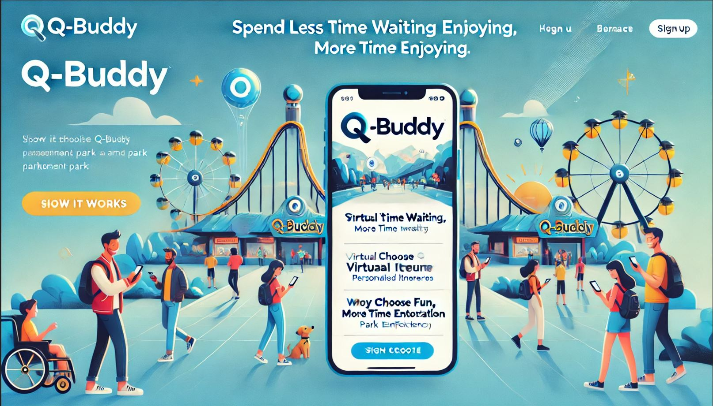

# Your startup name here

[My Notes](notes.md)

This startup is called Q-Buddy. It is designed to help amusement parks and other alike places retain their customers and help the customer have a more enjoyable time. It will create a digital queue and keep the place in line for someone without them having to stand waiting for long periods of time. 

> [!NOTE]
>  This is a template for your startup application. You must modify this `README.md` file for each phase of your development. You only need to fill in the section for each deliverable when that deliverable is submitted in Canvas. Without completing the section for a deliverable, the TA will not know what to look for when grading your submission. Feel free to add additional information to each deliverable description, but make sure you at least have the list of rubric items and a description of what you did for each item.

> [!NOTE]
>  If you are not familiar with Markdown then you should review the [documentation](https://docs.github.com/en/get-started/writing-on-github/getting-started-with-writing-and-formatting-on-github/basic-writing-and-formatting-syntax) before continuing.

## 🚀 Specification Deliverable

> [!NOTE]
>  Fill in this sections as the submission artifact for this deliverable. You can refer to this [example](https://github.com/webprogramming260/startup-example/blob/main/README.md) for inspiration.

For this deliverable I did the following. I checked the box `[x]` and added a description for things I completed.

- [ ] Proper use of Markdown
- [ ] A concise and compelling elevator pitch
- [ ] Description of key features
- [ ] Description of how you will use each technology
- [ ] One or more rough sketches of your application. Images must be embedded in this file using Markdown image references.

### Elevator pitch

Meet Q-Buddy, the ultimate solution to long lines at amusement parks. Our smart queuing system transforms the waiting experience by letting guests join virtual lines, freeing them to explore and enjoy the park while they wait. Powered by AI, Q-Buddy optimizes crowd flow and creates personalized schedules, enhancing the guest experience and increasing park efficiency. With Q-Buddy, we’re not just saving time—we’re creating more fun and memorable moments for everyone.

### Design

This design for Q-Buddy combines vibrant colors and playful elements to evoke the joy and excitement of amusement parks while maintaining a sleek, modern feel. The layout is user-friendly and mobile-responsive, with clear sections for "How It Works," "Why Choose Q-Buddy," and a strong call-to-action at the footer, ensuring easy navigation and engagement. The cheerful illustrations and dynamic icons reinforce the innovative and fun nature of Q-Buddy’s virtual queuing system.

### Key features

- Virtual Queueing
- Personalized Itineraries
- Real-Time Notifications

### Technologies

I am going to use the required technologies in the following ways.

- **HTML** - Build the foundational structure of the website, including sections like the homepage, "How It Works," "Why Choose Q-Buddy," and the login/signup pages.
- **CSS** - Design an engaging and vibrant visual theme using CSS for colors, typography, and layouts.
- **React** - Build a dynamic and interactive frontend for features like virtual queuing, personalized itineraries, and real-time notifications.
- **Service** - Develop backend APIs to handle operations like queue management, ride availability, and user data retrieval.
- **DB/Login** - Store session data for personalized itineraries and real-time updates.
- **WebSocket** - Use WebSocket to deliver instant ride status changes or reservation updates directly to the user interface.

## 🚀 AWS deliverable

For this deliverable I did the following. I checked the box `[x]` and added a description for things I completed.

- [ ] **Server deployed and accessible with custom domain name** - [My server link](https://yourdomainnamehere.click).

## 🚀 HTML deliverable

For this deliverable I did the following. I checked the box `[x]` and added a description for things I completed.

- [ ] **HTML pages** - I did not complete this part of the deliverable.
- [ ] **Proper HTML element usage** - I did not complete this part of the deliverable.
- [ ] **Links** - I did not complete this part of the deliverable.
- [ ] **Text** - I did not complete this part of the deliverable.
- [ ] **3rd party API placeholder** - I did not complete this part of the deliverable.
- [ ] **Images** - I did not complete this part of the deliverable.
- [ ] **Login placeholder** - I did not complete this part of the deliverable.
- [ ] **DB data placeholder** - I did not complete this part of the deliverable.
- [ ] **WebSocket placeholder** - I did not complete this part of the deliverable.

## 🚀 CSS deliverable

For this deliverable I did the following. I checked the box `[x]` and added a description for things I completed.

- [ ] **Header, footer, and main content body** - I did not complete this part of the deliverable.
- [ ] **Navigation elements** - I did not complete this part of the deliverable.
- [ ] **Responsive to window resizing** - I did not complete this part of the deliverable.
- [ ] **Application elements** - I did not complete this part of the deliverable.
- [ ] **Application text content** - I did not complete this part of the deliverable.
- [ ] **Application images** - I did not complete this part of the deliverable.

## 🚀 React part 1: Routing deliverable

For this deliverable I did the following. I checked the box `[x]` and added a description for things I completed.

- [ ] **Bundled using Vite** - I did not complete this part of the deliverable.
- [ ] **Components** - I did not complete this part of the deliverable.
- [ ] **Router** - Routing between login and voting components.

## 🚀 React part 2: Reactivity

For this deliverable I did the following. I checked the box `[x]` and added a description for things I completed.

- [ ] **All functionality implemented or mocked out** - I did not complete this part of the deliverable.
- [ ] **Hooks** - I did not complete this part of the deliverable.

## 🚀 Service deliverable

For this deliverable I did the following. I checked the box `[x]` and added a description for things I completed.

- [ ] **Node.js/Express HTTP service** - I did not complete this part of the deliverable.
- [ ] **Static middleware for frontend** - I did not complete this part of the deliverable.
- [ ] **Calls to third party endpoints** - I did not complete this part of the deliverable.
- [ ] **Backend service endpoints** - I did not complete this part of the deliverable.
- [ ] **Frontend calls service endpoints** - I did not complete this part of the deliverable.

## 🚀 DB/Login deliverable

For this deliverable I did the following. I checked the box `[x]` and added a description for things I completed.

- [ ] **User registration** - I did not complete this part of the deliverable.
- [ ] **User login and logout** - I did not complete this part of the deliverable.
- [ ] **Stores data in MongoDB** - I did not complete this part of the deliverable.
- [ ] **Stores credentials in MongoDB** - I did not complete this part of the deliverable.
- [ ] **Restricts functionality based on authentication** - I did not complete this part of the deliverable.

## 🚀 WebSocket deliverable

For this deliverable I did the following. I checked the box `[x]` and added a description for things I completed.

- [ ] **Backend listens for WebSocket connection** - I did not complete this part of the deliverable.
- [ ] **Frontend makes WebSocket connection** - I did not complete this part of the deliverable.
- [ ] **Data sent over WebSocket connection** - I did not complete this part of the deliverable.
- [ ] **WebSocket data displayed** - I did not complete this part of the deliverable.
- [ ] **Application is fully functional** - I did not complete this part of the deliverable.
